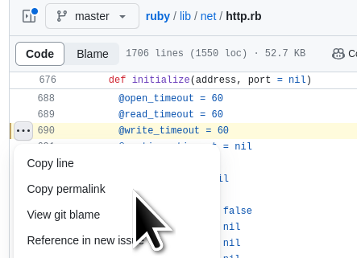
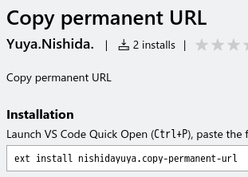

# ソースコード参照URIの考察と作成したツールの紹介

author
: 西田雄也

date
: 2023-09-16

allotted-time
: 20m

theme
: lightning-simple

start-time
: 2023-09-16

end-time
: 2023-09-16

# 自己紹介

- 西田雄也 ネットワーク応用通信研究所
- GitHub: [https://github.com/nishidayuya](https://github.com/nishidayuya)
- X（旧Twitter）: [https://twitter.com/nishidayuya](https://twitter.com/nishidayuya)
- なにかツールを作るのが趣味
    - [git-cococo](https://github.com/nishidayuya/git-cococo): Gitの作業ディレクトリ上で実行したコマンドによる変更をコミットメッセージに残しながらコミットするコマンド
    - [img_to_pdf](https://github.com/nishidayuya/img_to_pdf): 画像ファイルを大きく印刷するために複数ページのPDFにするコマンド
    - [redmine_ruby_wasm](https://github.com/nishidayuya/redmine_ruby_wasm): Redmineに書いたRubyのコードを実行
    - [dpu](https://github.com/nishidayuya/dpu): 今日紹介するもの

# では

# 想像してください

# 想像してください

- とあるウェブサービスのクライアントプログラムの改修をしていました．
- POSTする際のデフォルトのタイムアウト時間は60秒でした．
- なぜ60秒であるのか．
- 調べたところ，あるpull-requestに辿り着きました．

# 悲劇

# 参照先のURIが見当違い

# なぜでしょうか

# なぜでしょうか

- コメントが書かれた当時(2021-01-07)は合っていた ✨

↓

- 対象リポジトリの開発が進んだ 🎉
- 当該コードの行番号が変わった 👀

↓

- コメントはそのままのため，不適切な位置になった 😭

# 発生する場面

今回はpull-requestのコメントでした

- ソースコード上のコメント
- X（旧Twitter）のポスト
- ブログ記事
- ...

↓

ソースコードを参照するURIを書く全ての場面

# そうすると

# どうすれば良かったのか

# どうすれば良かったのか

- ブランチ名によるURI
    - https://github.com/ruby/ruby/blob/master/lib/net/http.rb#L690
    - 　　　　　　　　　　　　　　　　　↑↑↑↑ここ

# どうすれば良かったのか

- ブランチ名によるURI
    - https://github.com/ruby/ruby/blob/master/lib/net/http.rb#L690
    - 　　　　　　　　　　　　　　　　　↑↑↑↑ここ変える

↓

- コミットIDかタグを元にしたURIにする
    - https://github.com/ruby/ruby/blob/4d0985a7bd8f591dff4b430e288bfd83af782e51/lib/net/http.rb#L690
- masterブランチに新しいコミットが積まれてもそのままでOK！ 🎉

# GitHub.comの場合

# GitHub.comの場合

- 三点リーダークリック→「Copy permalink」クリック
    - y C-l C-cでコピーしても良い

{:relative_height='90'}

- コミットIDを元にしたURIが得られる！

# 解決

# でも...

# でも...

- いちいちウェブブラウザ上でソースコードを参照するのは面倒
    - テキストエディター上で読むことが多いため
- 手でURIを作るのも面倒

↓

- 手元のテキストエディターからサクッとURIを取得したい．

↓

# エディターの拡張を書こう

# エディターの拡張を書こう

- 自分が使うテキストエディター
    - Emacs: 普段使い
    - Textbringer: 軽い編集時
    - Vim: sudoで編集するとき
    - Visual Studio Code: ペアプロ・モブプロ時にLiveShare

↓

- いっぱいある

# エディターの拡張を書こう

- 自分が使うテキストエディター
    - Emacs: Emacs Lispで書く
    - Textbringer: Rubyで書く
    - Vim: Vim scriptで書く（らしい）
    - Visual Studio Code: TypeScriptやJavaScriptで書く

↓

- URIを決定するのはRubyで書いて各拡張から呼びだそう！

# デモ

# dpu.gem: determine permanent URI

- `gem install dpu`
- https://github.com/nishidayuya/dpu
- タグを使ったURIを生成するメソッドとコマンド
    - 最新20タグ以内に同一内容のファイルがなかったらコミットIDを使う．

↓

- ブランチURIの悲劇は起こさない．

# dpu.gem

- なぜタグを使うか．
- 短い
    - https://github.com/ruby/ruby/blob/v3_0_0/lib/net/http.rb#L690
    - https://github.com/ruby/ruby/blob/4d0985a7bd8f591dff4b430e288bfd83af782e51/lib/net/http.rb#L690
- 動いているプログラムの調査をするときは，
  動かしているバージョンのソースコードを調べる．
    - URIを見ただけでバージョンが明らか

# dpu.gem

対応しているSCMのサービス

- GitHub.com
- sourcehut
    - pull-requestいただきました
- (GitLab.com)

# dpu.gem - EmacsとTextbringer

- https://github.com/nishidayuya/dpu に設定方法
- Emacs
    - .emacsに書いて使う
- Textbringer
    - .textbringer.rbに書いて使う
    - 直接dpu.gemのメソッド呼び出しをしている．

# dpu.gem - Vim

- 自分がVim scriptわかってない
- sudoで編集するときなので作っていない

↓

- どなたか作られましたらご連絡ください！

# dpu.gem - Visual Studio Code

- Marketplaceに出してます
    - [Copy permanent URL](https://marketplace.visualstudio.com/items?itemName=nishidayuya.copy-permanent-url) で検索
    - https://marketplace.visualstudio.com/items?itemName=nishidayuya.copy-permanent-url
- 2023-09-15時点のインストール数は脅威の

# dpu.gem - Visual Studio Code

- Marketplaceに出してます
    - [Copy permanent URL](https://marketplace.visualstudio.com/items?itemName=nishidayuya.copy-permanent-url) で検索
    - https://marketplace.visualstudio.com/items?itemName=nishidayuya.copy-permanent-url
- 2023-09-15時点のインストール数は脅威の
    - {:relative_height="130" :align="right" :relative_margin_right="-5"}

# dpu.gem - Visual Studio Code

- ruby.wasmを同梱して呼び出そうと考えた．

↓

- dpu.gemのインストールをしなくても
  拡張をインストールしたら使えるように
- （Rubyが入っていないとしてもすぐ使える）

# dpu.gem - Visual Studio Code

- ruby.wasmを同梱して呼び出そうと考えましたが...

↓

- dpu.gemは中でGitのコマンドを実行する．
- https://github.com/ruby/ruby/blob/a1dc1a3de9683daf5a543d6f618e17aabfcb8708/wasm/README.md#current-limitation より
    - Spawning a new process is not supported. e.g. Kernel.spawn and Kernel.system
- ruby.wasmの下にあるwasi libcをコマンド実行に対応させる必要がありそう...→調査できてない

# 類似ソフトウェア

- Emacs
    - [git-link](https://github.com/sshaw/git-link): https://github.com/sshaw/git-link
- Vim
    - [vim-github-link](https://github.com/knsh14/vim-github-link): https://github.com/knsh14/vim-github-link
- Visual Studio Code
    - [GitHub Pull Requests and Issues](https://marketplace.visualstudio.com/items?itemName=GitHub.vscode-pull-request-github)
    - [vscode-copy-github-permalink](https://marketplace.visualstudio.com/items?itemName=hogashi.vscode-copy-github-permalink)
    - [Copy GitHub URL](https://marketplace.visualstudio.com/items?itemName=mattlott.copy-github-url)

# まとめ

- ブランチへのURIは古くなる→やめよう
- タグまたはコミットIDを使ったURIを使う
- ツールもあるよ！
- スターはこちら→[https://github.com/nishidayuya/dpu](https://github.com/nishidayuya/dpu)

{:relative_height="130" :align="right" :relative_margin_right="-5"}
